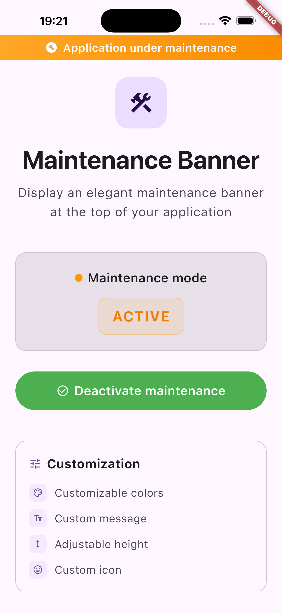

# maintenance_banner

A Flutter package for displaying customizable maintenance banners at the top of your app.



## Features

- 🎨 **Fully Customizable**: Use your own banner widget or customize colors, message, height, and icon
- 📱 **Safe Area Aware**: Automatically handles device safe areas (notches, status bars)
- 🔄 **Simple Integration**: Easy to integrate with `MaintenanceWrapper`
- 🎯 **Flexible**: Works with any state management solution (setState, Provider, Bloc, etc.)
- ⚡ **Lightweight**: No external dependencies except Flutter

## Installation

Add this to your package's `pubspec.yaml` file:

```yaml
dependencies:
  maintenance_banner: ^0.1.0
```

Then run:

```bash
flutter pub get
```

## Usage

### Basic Usage

Wrap your app with `MaintenanceWrapper` and provide a custom banner widget:

```dart
import 'package:flutter/material.dart';
import 'package:maintenance_banner/maintenance_banner.dart';

class MyApp extends StatelessWidget {
  @override
  Widget build(BuildContext context) {
    return MaterialApp(
      home: MaintenanceWrapper(
        isUnderMaintenance: true, // or use a state variable
        banner: Container(
          height: 32,
          color: Colors.orange,
          child: const Center(
            child: Text('Application under maintenance'),
          ),
        ),
        child: HomePage(),
      ),
    );
  }
}
```

### With State Management

```dart
class MyApp extends StatefulWidget {
  @override
  State<MyApp> createState() => _MyAppState();
}

class _MyAppState extends State<MyApp> {
  bool isUnderMaintenance = false;

  @override
  Widget build(BuildContext context) {
    return MaterialApp(
      home: MaintenanceWrapper(
        isUnderMaintenance: isUnderMaintenance,
        banner: Container(
          height: 32,
          color: Colors.orange,
          child: const Center(
            child: Text(
              'Application under maintenance',
              style: TextStyle(color: Colors.white),
            ),
          ),
        ),
        child: HomePage(),
      ),
    );
  }
}
```

### Customization Options

The `MaintenanceWrapper` widget accepts the following parameters:

| Parameter | Type | Required | Description |
|-----------|------|----------|-------------|
| `isUnderMaintenance` | `bool` | Yes | Whether the app is currently under maintenance |
| `banner` | `Widget` | Yes | The custom banner widget to display |
| `child` | `Widget` | Yes | The child widget (your app content) |
| `topPadding` | `double?` | No | Custom top padding. If null, uses safe area padding - 8 |
| `message` | `String?` | No | (Legacy) Message for banner (if not using custom banner) |
| `backgroundColor` | `Color?` | No | (Legacy) Background color (if not using custom banner) |
| `textColor` | `Color?` | No | (Legacy) Text color (if not using custom banner) |
| `height` | `double?` | No | (Legacy) Banner height (if not using custom banner) |
| `icon` | `String?` | No | (Legacy) Icon emoji (if not using custom banner) |

### Advanced Example

```dart
MaintenanceWrapper(
  isUnderMaintenance: maintenanceController.isMaintenanceMode,
  topPadding: 0, // Override default padding
  banner: Container(
    height: 40,
    decoration: BoxDecoration(
      gradient: LinearGradient(
        colors: [Colors.orange.shade400, Colors.orange.shade600],
      ),
    ),
    child: Row(
      mainAxisAlignment: MainAxisAlignment.center,
      children: [
        Icon(Icons.build, color: Colors.white, size: 20),
        SizedBox(width: 8),
        Text(
          'Maintenance en cours',
          style: TextStyle(
            color: Colors.white,
            fontWeight: FontWeight.bold,
            fontSize: 14,
          ),
        ),
      ],
    ),
  ),
  child: YourApp(),
)
```

## How It Works

The `MaintenanceWrapper` widget:
1. Checks the `isUnderMaintenance` boolean
2. If `true`, wraps your app with `MaintenanceBannerWidget` which displays the banner in a `Stack`
3. The banner is positioned at the top, respecting safe areas
4. Your app content is automatically padded to avoid overlap

## Example App

Check out the `example` directory for a complete working example:

```bash
cd example
flutter pub get
flutter run
```


## Requirements

- Flutter SDK: `>=3.0.0`
- Dart SDK: `>=3.0.0 <4.0.0`

## Contributing

Contributions are welcome! Please feel free to submit a Pull Request.

## License

MIT License - see [LICENSE](LICENSE) file for details.
